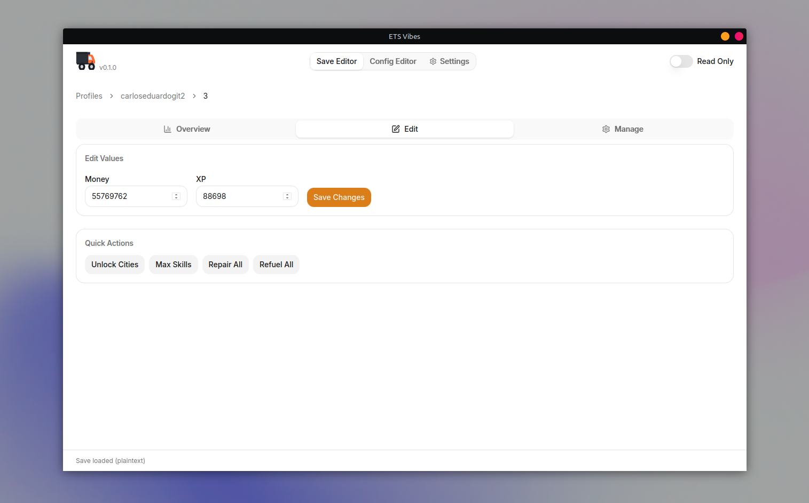
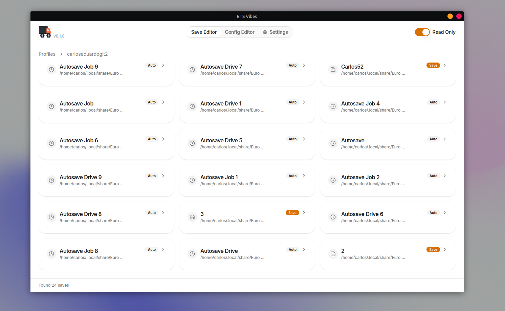
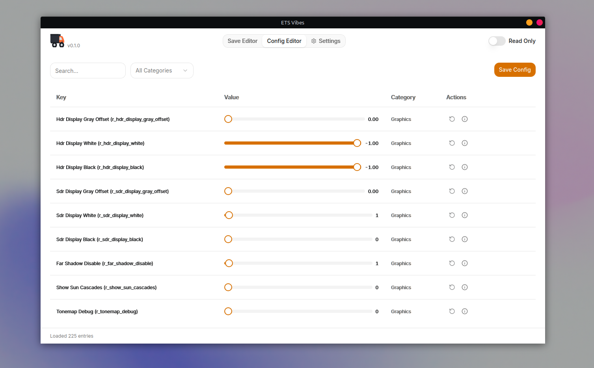

<picture>
  <source media="(prefers-color-scheme: dark)" srcset="assets/logo.svg">
  
</picture>

  

A cross-platform desktop app for **Euro Truck Simulator 2** (ATS support planned). Browse profiles, edit saves and config files, tweak your trucks, unlock cities, and fine-tune the game to your liking — all in one place with a clean, modern interface.

**Why ets-vibes?** Because digging through `game.sii` with a text editor and manually converting hex wear values isn't fun. Existing tools work, but they feel dated. ets-vibes is a modern alternative to TS SaveEditor Tool — native performance, safety-first design, and an interface that actually feels good to use.

**Safety first.** Every change creates an automatic timestamped backup. Read-only mode is the default — you explicitly enable editing. Values are validated before they're saved. No silent corruption.

**Made for the "vibes".** Minimal, responsive, adapts to your theme. No clutter, no ads, no telemetry.

## Highlights

- **Save editor** with full stats view — money, XP, level, distance, fuel, trucks, garages, visited cities, mods, and more
- **Quick actions** — unlock all cities, max skills, repair all trucks, refuel all — one click, with confirmation
- **Config editor** with plain-English descriptions for every key, type validation, search, and category filters
- **Automatic game detection** — finds your ETS2 install on Windows, Linux, and macOS (Steam + local)
- **Backup everything** — every edit creates a timestamped backup before touching your files
- **Read-only by default** — enable editing explicitly, never accidentally corrupt a save

---

## For Players

### Features

- **Save editor** — Browse your profiles and saves. View stats like money, XP, level, distance driven, fuel used, visited cities, active mods, and truck details (odometer, fuel level, engine/transmission/cabin/chassis wear).
- **Edit money & XP** — Change your money and experience points directly.
- **Quick actions** — One-click operations with confirmation:
  - Unlock all cities in a save
  - Max out all driver skills
  - Repair all trucks (including unfixable wear)
  - Refuel all trucks
- **Manage saves** — Rename, clone, or delete saves (with automatic backups).
- **Config editor** — Browse, search, and edit your game's `config.cfg` entries. Changes are validated by type (int, float, bool, string) before saving. Each key has a plain-English description so you know what it does.
- **Read-only mode** — Toggle read-only mode to prevent accidental edits.
- **Theme support** — Light, dark, and system theme.
- **Compatibility check** — Shows the detected game version and warns if it's older than the tested range.

  
  
<em>Browse profiles and saves</em>

  
  
<em>Browse and edit config.cfg entries with plain-English descriptions</em>

### How it works

ets-vibes automatically detects your ETS2 installation path across Windows, Linux, and macOS — including Steam userdata directories and OneDrive Documents folders on Windows. It finds your profiles, lists their saves, and opens `game.sii` files whether they're plaintext or compressed (the SCS encryption format). Edits always create a timestamped backup first.

### Download

Head to the [Releases](https://github.com/carlosedujs/ets-vibes/releases) page for pre-built binaries.

---

Want to contribute? See [CONTRIBUTING.md](CONTRIBUTING.md) for architecture, code examples, and development setup.
